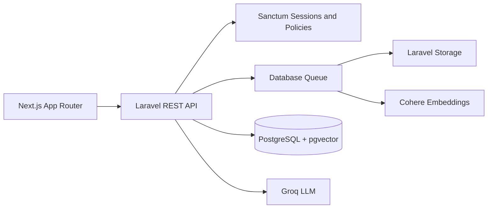

# Sift

Sift is an AI-powered knowledge assistant that turns company documents into grounded, verifiable answers using retrieval-augmented generation (RAG).

Teams can upload company knowledge, ask questions internally, provide customers with an embeddable support widget, and route unsupported questions to human review instead of relying on fabricated answers.

## Key features

- PDF knowledge upload with visible Processing, Ready, and Failed states
- Queued text extraction, page-aware chunking, embeddings, and vector storage
- Workspace-isolated semantic retrieval with PostgreSQL and pgvector
- Grounded Assistant answers with trusted document and page citations
- Safe Needs Review outcome when the available evidence is insufficient
- Human review queue with resolution workflow
- Assistant interaction history with citation snapshots
- Workspace overview backed by real document, interaction, and review data
- Company registration and session-based authentication with Laravel Sanctum
- Owner, Admin, and Member permissions with team invitations and role management
- Embeddable customer-facing chat widget using the same knowledge base
- Prepared Guest Demo with real, non-persistent RAG questions
- Responsive Next.js interface using Sift's Fog + Burgundy design system

PDF extraction currently supports documents with an embedded text layer. OCR for scanned or image-only PDFs is not included.

## How RAG works

### Document ingestion

```text
PDF upload
→ queued processing
→ page-aware text extraction
→ deterministic chunking
→ Cohere document embeddings
→ PostgreSQL + pgvector
→ document marked Ready
```

### Question answering

```text
Question
→ Cohere query embedding
→ workspace-scoped cosine retrieval
→ bounded evidence context
→ grounded Groq generation
→ Answered with trusted citations
   or Needs Review
```

Retrieval is always scoped to the active workspace. Citations are built from trusted source metadata rather than invented by the language model, and provider integrations remain replaceable behind application contracts.

## Architecture



Next.js handles routing, rendering, responsive UI, and browser interactions. Laravel is the source of truth for authentication, authorization, validation, persistence, document processing, and RAG orchestration. PostgreSQL stores application data and vectors, while database-backed queue workers process uploaded documents outside the request lifecycle.

Provider-specific embedding, retrieval, and generation details are isolated behind dedicated contracts.

```text
backend/    Laravel REST API, domain logic, processing, and tests
frontend/   Next.js App Router application
docker/     PostgreSQL initialization
compose.yaml
```

## Technology stack

| Layer | Technology |
|---|---|
| Frontend | Next.js 16, React 19, TypeScript, CSS Modules |
| Backend | Laravel 13, PHP 8.3+, Laravel Sanctum |
| Database | PostgreSQL 17, pgvector |
| Embeddings | Cohere `embed-v4.0` |
| Generation | Groq `openai/gpt-oss-20b` |
| PDF extraction | `smalot/pdfparser` |
| Background processing | Laravel database queues |
| Local infrastructure | Docker Compose |
| Quality | PHPUnit, Laravel Pint, ESLint, TypeScript |

## Customer Chat Widget

Sift includes an embeddable customer-facing widget that lets website visitors ask questions against approved workspace knowledge without dashboard accounts.

Workspace owners can provision the widget, enable or disable it, rotate its public identifier, copy the embed code, and preview the customer experience. Production widget interactions are retained in Conversations and can enter the Review workflow when knowledge is insufficient. Public responses intentionally omit internal AI and retrieval metadata.

The public Sift landing page also contains a portfolio Demo Widget. It uses the real RAG pipeline against prepared Demo knowledge but does not persist conversations, history, or Review items.

## Guest Demo

The one-click Guest Demo provides a prepared workspace without requiring registration. Guests can:

- View Overview, Knowledge, prepared Conversations, and Review items
- Ask real questions through the Assistant
- Receive grounded answers or a safe Needs Review response

Guest questions are non-persistent and cannot change the prepared dataset. Guest access cannot upload documents, resolve Review items, change Settings, or manage Team members.

## Roles and permissions

| Capability | Owner | Admin | Member | Guest Demo |
|---|:---:|:---:|:---:|:---:|
| Overview | View | View | View | View |
| Assistant | Use | Use | Use | Non-persistent |
| Knowledge | Manage | Manage | — | View |
| Conversations | View | View | — | Prepared history |
| Review | View and resolve | View and resolve | View and resolve | View |
| Settings | View and update | View | — | — |
| Team | Manage | — | — | — |

Permissions are enforced by Laravel policies and workspace membership checks. Permission-aware frontend navigation is a usability layer, not the authorization boundary.

## Local development

### Requirements

- PHP 8.3 or newer with the PostgreSQL PDO extension
- Composer
- Node.js 20.9 or newer and npm
- Docker with Docker Compose

### PostgreSQL and pgvector

From the project root:

```bash
cp .env.example .env
docker compose up -d postgres
docker compose ps
```

The container initializes pgvector and creates the `sift` development database and the isolated `sift_testing` database used by the backend test suite.

### Laravel API

```bash
cd backend
composer install
cp .env.example .env
php artisan key:generate
php artisan migrate
php artisan serve
```

The API runs at `http://localhost:8000/api`. The database-aware health endpoint is available at `http://localhost:8000/api/health`.

### Next.js frontend

In a separate terminal:

```bash
cd frontend
npm install
cp .env.example .env.local
npm run dev
```

The frontend runs at `http://localhost:3000`.

## Environment configuration

Copy the committed environment examples and provide values appropriate to your local environment. Important configuration groups include:

- Application and frontend URLs
- PostgreSQL connection details
- Sanctum stateful domains and allowed frontend origin
- Cohere and Groq provider credentials
- Document storage, upload, and processing settings
- Queue connection and document-processing queue
- Optional Guest Demo and Demo Widget settings
- Customer Widget limits and conversation lifetime

The frontend requires `NEXT_PUBLIC_API_URL` to point to the Laravel API.

Never commit populated `.env` files, API keys, database credentials, or Demo identifiers.

### Optional prepared Demo

After configuring the AI providers, validate and provision the bundled Guest Demo with:

```bash
cd backend
php artisan sift:provision-demo --dry-run
php artisan sift:provision-demo
```

The provisioning command reports the generated Demo identifiers for local environment configuration. Do not commit those values.

## Queue worker

Document extraction, chunking, and embedding run on the dedicated `documents` queue. Start a worker in a separate terminal:

```bash
cd backend
php artisan queue:work database --queue=documents --tries=1 --timeout=300
```

The API, frontend, PostgreSQL, and queue worker must all be running to exercise the complete upload and ingestion workflow.

## Testing and quality

Backend checks use the isolated `sift_testing` PostgreSQL database:

```bash
cd backend
composer test
vendor/bin/pint --test
composer validate --strict
```

Frontend checks:

```bash
cd frontend
npm run lint
npm run typecheck
npm run build
```

Automated tests mock Cohere and Groq rather than consuming real provider quota. The backend suite covers authentication, workspace isolation, permissions, document processing, RAG orchestration, persistence safety, human review, interaction history, Demo behavior, and public widget boundaries.
